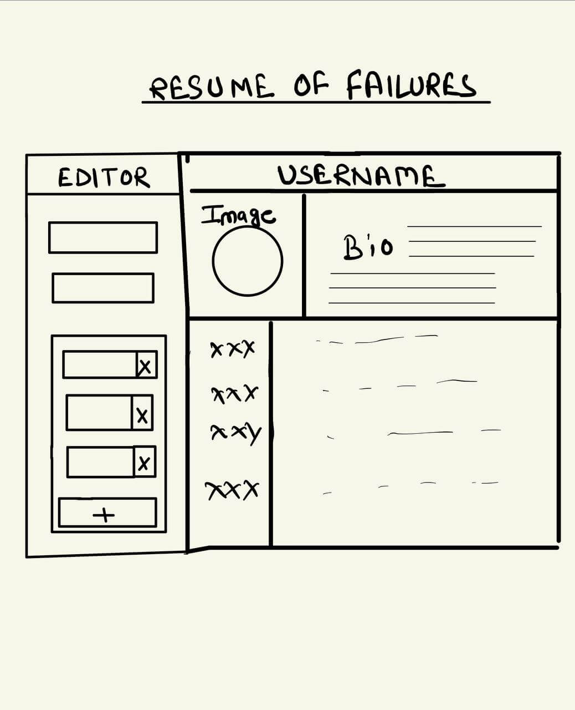

A few days back I posted [Let's talk about failures](./lets-talk-about-failures), where I talked about the importance of sharing failures out in the open. It received a good response and some people told me they liked the idea. It got me thinking if people are liking this idea, why is it not a real thing yet. Are there any existing platform where I can create a resume of failure and share it publically.

## Research stage
I did some research and realised that the concept of Failure resume is nothing new. A lot of successfull people maintain a failure resume to to keep track of their failures.

[Daniel Pink](https://www.danpink.com/) is famous for his studies of motivation, including the New York Times bestseller "[Drive](https://www.amazon.com/Drive-Surprising-Truth-About-Motivates/dp/1594484805)," says "Create a failure résumé to feel more satisfied about your career". One way to make your career regrets "less fearsome" is by talking to people about them, Pink said. Doing so will help you articulate the lessons you've learnt.

I have realised that the concept of failure resume is quite established already and there must be many web apps allowing you to create your failure resume. But when I searched for such apps all I found were bunch of resume builder apps focusing on your achievements.

## Prototyping
So I decided to do something about this. I hand drawn an ugly blueprint of how the app should look like. Once I have that ready, I started thinking about a suitable name for the app. After considering many options I settled down with "bummer".  Bummer means a disappointing or unpleasant situation or experience. The domain [bummer](https://bummer.me) was available so I immediately purchased it and started working on the app idea.

## Initial Design
Since the website is all about failures I wanted to keep the design pretty dull and not contain flash of colors, so I decided to settle with just one color and play with tranparency to create different shades. Now the initial mockup is ready to be tested with real users.

## Validatioin and Testing
With this post I am moving to the next stage of validation and testing the app. Anyone interested can signup and test the app. Create and share your own bummer. I am not sure what the future of bummer is, it may become a place hosting hundreds of bummers or just get added as another items in my bummer profile.

Bummer is open source and comes with MIT licence so you can also dig inside the source code of the website at github and get inspired.
- **Website:** https://bummer.me
- **Github:** https://github.com/ak4zh/bummer