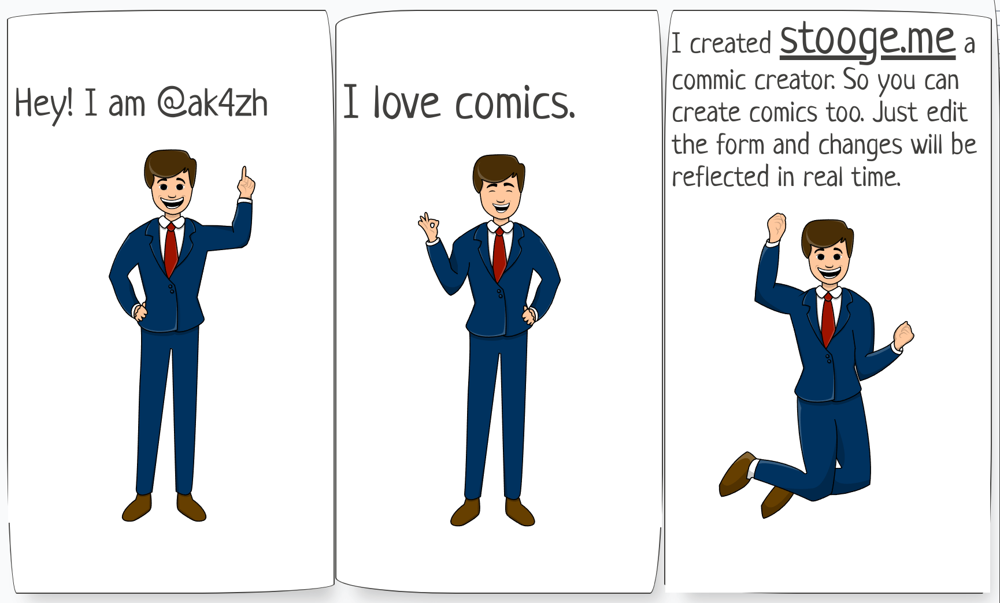
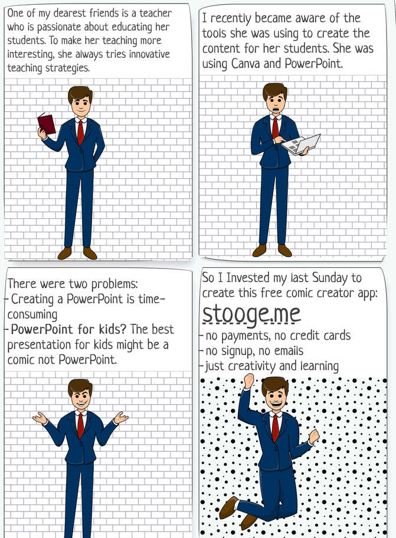

We all love comics. Comic strips does not intimidate struggling readers with an overwhelming page of text. With easy-to-read short sentences and visual cues, comics are much more engaging than a novel or a short story. 

Comics are also helpful for children with learning difficulties; children with autism can learn a lot about identifying emotions through the images in a comic book. Children with dyslexia, who may find it frustrating to finish a page in a traditional book, often feel a sense of accomplishment when they complete a page in a comic book.
But not all educators and storytellers can draw, I cannot even draw a perfect circle. So I have created [stooge](https://stooge.me), a comic creator app to help educators and storytellers create comics without the need to draw anything.

## Backstory

One of my dearest friends is a teacher who is passionate about educating her students. To make her teaching more interesting, she always tries innovative teaching strategies.  
  
I recently became aware of the tools she was using to create the content for her students. She was using Canva and PowerPoint.  
  
There were two problems:  
- Creating a PowerPoint is time-consuming  
- PowerPoint for kids? The best presentation for kids might be a comic, not PowerPoint.  
  
So I invested my last weekend to create [stooge](https://stooge.me/).

## Why the name stooge?

The dictionary meaning of **stooge** is someone who helps the main comedian to deliver his jokes, someone who allows himself to be used for others advantage. Stooge roughly means a puppet.
So that’s why I choose the name stooge. Stooge helps you to deliver your story to your audience in a much interesting and engaging format.

That’s how stooge was born.

I would appreciate any feedback or suggestions you may have.