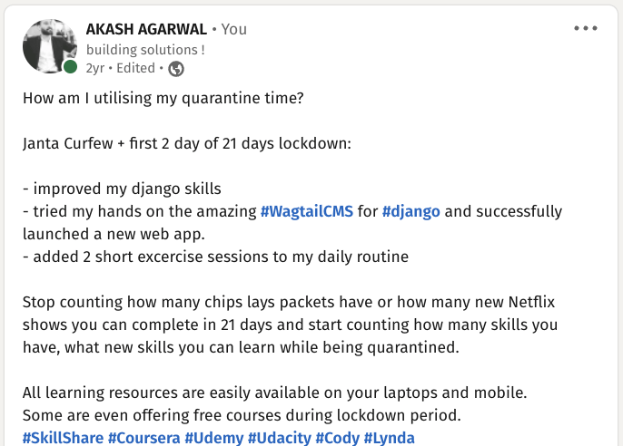

## The launch
ConfluxBot was launched as a SaaS (software as a service) product in late 2018.
There was no other software available in the market similar to ConfluxBot, and I knew it had the potential to become my hero product.

I was consistently adding new features to make it the best software of its type. Soon after the launch of ConfluxBot, it became the product that started to account for approximately 50% of my revenue.

## The Covid-19 impact
When Covid-19 arrived, I was not at all worried as I was already working from home, and my business was online. I was the sole developer of ConfluxBot, I was sure covid wouldn’t bring any impact on my business, but it did.

Covid resulted in offices getting shut down, which gave rise to developers globally having idle time. Some idle developers saw the opportunity in conflux and decided to copycat.

By the end of March 2020, I started to see multiple clones of conflux bot emerging out of nowhere. Some of these clones were good and even had better features than conflux.

## The big mistake
In those days, I used to have a telegram group where my customers could discuss ideas and give me direct feedback so I could improve the software. In the past two years I had already implemented every single feature users had requested and I was not getting much of new requests as users were already happy with the current set of features.

I realised I made the following two major mistakes:
- I stopped innovating and improving the product as I assumed users are already satisfied.
- I kept the database of customers out in the open (the telegram discussion group).

Few of these copycat developers got their hands on my customers list, and they started poaching my clients.
At that time, the membership of ConfluxBot was $15 a month. These copycat developers promised to offer their software with more features at half the price, $7 a month.

## Business was dying
Everyone loves savings, so it attracted some price-sensitive customers immediately, and in the next two months, I had already lost 40-45% of my business to these competitors.
I would not blame it on them, as I was impressed by a few of the competitors offering many more features than Conflux at half the price. I would have made the switch myself.

I did attempt to implement all the competitor's features on Conflux quickly, but it was not an easy path. Conflux codebase is now two years old and has seen many iterations over the period. Now the codebase was a mess, and I had made some bad design decisions at the early stage, making it impossible to implement some of the new features.

## I was furious, frustrated and disappointed
It was my original idea, and I was losing it. Other developers were banking on my idea.
I understood I had to make a wise decision quickly or start looking for a new startup idea.

## The big risk
At this point, I decided to risk it all. I decided if I cannot bank on my idea anymore, a copycat should not be able to, as well.
I took a bold step that could have ultimately killed the opportunity for anyone to bank on this idea anymore.

## I self-cannibalized ConfluxBot
I open-sourced the codebase for the core features of ConfluxBot. I even created a step-by-step tutorial on youtube on how I created ConfluxBot and how anyone can do it themselves.
Now the people who were leaving conflux to save 50% on cost can keep 100% of their money and host the software themselves.

> If You Don't Cannibalize Yourself, Someone Else Will.  
>   
> -- <cite>Steve Jobs</cite>  

Everything changed. It shook the competitors, as the whole codebase was wide open. Now that 50% saving is not as attractive, people can save 100% of their money instead.
It paused the growth of my competitors and made us all lose business for the next few months.

I had bought the time I needed to get back on the growth track strategically. Next few months, I dedicated myself to learning Django, a web framework. Before, I was not considering moving to web development as I was a good backend developer but a terrible designer.

If I wanted to survive the competition, I just not had to build a better version but a unique one, and I knew a web app was the way to go as every other competitor was constructed inside of telegram, which has its limitations.

> You can't look at the competition and say you're going to do it better. You have to look at the competition and say you're going to do it differently.  
>
> <cite>Steve Jobs</cite>  

After around four months, it started to look like a finished product, my first ever web app. It was multi-fold powerful than the existing version of conflux and much more advanced than any of the current competitors.

It had all the features I planned, yet it was not as appealing to the eyes; remember, I still suck as a designer. Much more work was needed to polish the app, but I decided not to wait any longer and did a soft launch. It helped me launch at the right time and still be able to keep polishing and improving the product while getting immediate feedback from the actual users.

The new Conflux was now unique and often better than any existing alternatives. Instead of lowering prices to match the competitors, I could now keep the same base price of $15 a month and launch three more premium plans, and now the most premium package was $100 a month.

## I slowly regained most of the lost customers
At this point, many customers started to understand that it’s not the product they pay for but the service and convenience.
Hosting the codebase themselves was free, but it was cumbersome. Managing the server was not as convenient as paying a small monthly fee and having it all handled and regularly updated with new features.

Even those comfortable managing the server themselves still come back to me when they need any new feature added.

The competitors were giving me competition on price. However, instead of lowering the prices, I survived by increasing the value of my product and still being able to charge a premium price for quality, convenience and customer satisfaction.

> Never ever compete on prices, instead compete on services and innovation.  
>   
> <cite>Jack Ma</cite>   

To this date, Conflux still maintains majority of the market share while still charging a premium price.

I have learned many lessons in my Conflux journey, and I no longer wait for a competitor to force me to innovate.
I innovate and improve my service every single day.

I do not fear self-cannibalize anymore.

As of 2022, I am working on the third iteration of Conflux, which will overcome some leftover limitations the current one has and help me stay ahead of the competition.